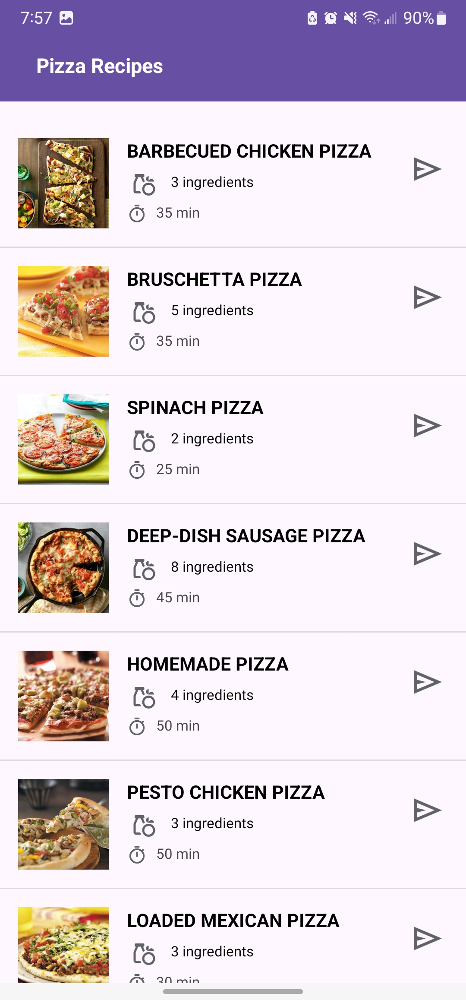
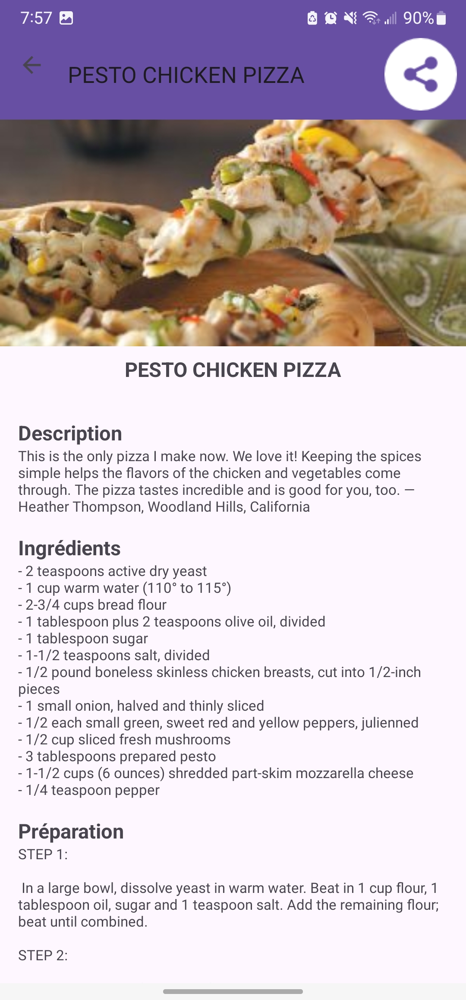

# Description
Cette application mobile Android permet de présenter des recettes de pizza avec leurs images et descriptions.  Elle offre une interface simple pour explorer diverses recettes de pizza.

# Fonctionnalités Principales
**Affichage de la Liste des Pizzas :** Une liste dynamique des recettes de pizza, avec une vue personnalisée pour chaque ligne.  
**Recettes détaillées :**  Vue personnalisée pour chaque pizza, contenant une description, les ingrédients et les étapes de sa préparation.

# Fonctionnalités supplémentaires
**Écran de Démarrage Animé :** Un écran de démarrage avec animation qui redirige vers la liste des pizzas. 
**Partage via WhatsApp :** En sélectionnant une recette, l'utilisateur peut appuyer sur le bouton de partage, qui génère un message contenant la description et les détails de la pizza et l'envoie directement à un contact sur WhatsApp.

# Installation
Pour exécuter cette application sur votre propre appareil Android, suivez les étapes ci-dessous :

**1.** Clonez ce dépôt sur votre machine locale : git clone https://github.com/aya-elloubab/Pizza-Recipes-Android-Application.git  
**2.** Ouvrez le projet dans Android Studio.  
**3.** Compilez et exécutez l'application sur un émulateur ou un appareil Android physique.  

## Captures d'écran

### Écran de démarrage

### Liste des Pizzas

### Détail de la recette

## Vidéo Démo

